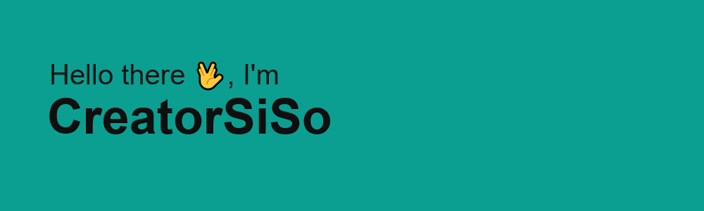

<!--


**CreatorSiSo/creatorsiso** is a ✨ _special_ ✨ repository because its `README.md` (this file) appears on your GitHub profile.

Here are some ideas to get you started:

- 🔭 I’m currently working on ...
- 🌱 I’m currently learning ...
- 👯 I’m looking to collaborate on ...
- 🤔 I’m looking for help with ...
- 💬 Ask me about ...
- 📫 How to reach me: ...
- 😄 Pronouns: ...
- ⚡ Fun fact: ...
-->

# Simon Sommer

Welcome ✌️,

```rust
todo!("Finish profile README.md");
```

I want to build software the you can love because it . . .

- is performant
- acknowledges that errors will happen
  - display them nicely
  - help users to understand them
- has readable code
- has documentation
  - written
  - examples

To me these are all have the same importance. (not sorted in a particular order)

<br/>

**I am working in / with –**

`🧊 Blender` `📝 VSCode` `🖌️ Figma`

`🦀 Rust` `📛 C++` `🧶 TypeScript` `✨️ Bash` `🐍 Python`

`🚀 Astro` `🐦 Bevy` `📨 Axum`

<br/>

<p>
    
    
</p>

<br/>

**Active projects –**

<!-- `🌍 My Website` https://www.creatorsiso.xyz -->

[`🗓 HTWK Calendar`][project:htwk-calendar] Custom calendar that nicely displays scraped events for one seminar group.<br/>
[`📙 Rym Lang`][project:rym] Programming language I started to write as part of my year 12 thesis.<br/>
<!-- [`🤖 Stringx`][project:stringx] Usability extension traits for Rust strings.<br/>
 [`🏗️ Annotate Snippets`][project:annotate_snippets_builder] Builder pattern abstraction for the annotate-snippets crate.<br/> -->

<br/>

**Other Stuff –**

[`💡 Ideas`](https://github.com/CreatorSiSo/my-lists/blob/main/ideas.md)
[`🛠 My Tools`](https://github.com/CreatorSiSo/my-lists/blob/main/apps.md)

[project:htwk-calendar]: https://github.com/creatorsiso/htwk-calendar
[project:rym]: https://github.com/creatorsiso/rym
[project:stringx]: https://github.com/creatorsiso/stringx
[project:annotate_snippets_builder]: https://github.com/creatorsiso/annotate_snippets_builder

[people:creatorsiso]: https://github.com/creatorsiso
